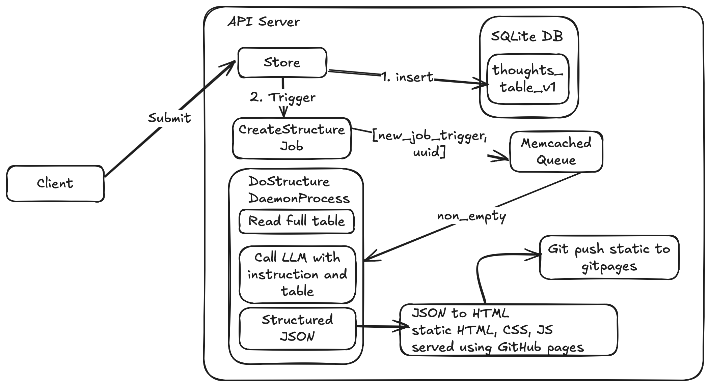

# Thoughts - A tool to capture and structure your thoughts

This project is a Python application designed to capture scattered thoughts, store them in a database, and then use a Large Language Model (LLM) to structure them into a more coherent format. The structured thoughts are then rendered as a static HTML page.

## Architecture

The application consists of a few key components:
- A **FastAPI server** that provides an endpoint to submit thoughts.
- A **SQLite database** to store the thoughts.
- A **Memcached queue** to trigger a background job.
- A **background worker** that listens for jobs, processes the thoughts using an LLM (Gemini), and generates a static HTML page.
- A simple **web client** to submit thoughts.
- The final output is a **static website** served from the `static` directory.

## Getting Started

### Prerequisites

- Python 3.9+
- [Poetry](https://python-poetry.org/docs/#installation) for dependency management.
- [Memcached](https://memcached.org/downloads). On macOS, you can install it with `brew install memcached`.

### 1. Installation

Clone the repository and install the dependencies using Poetry:

```bash
git clone <repository_url>
cd thoughts
poetry install
```

### 2. Configuration

The application requires a `.env` file for configuration. Create one in the root of the project by copying the example format below.

**This file is ignored by Git and should not be committed to version control.**

```bash
# Create a .env file in the root directory with the following content:
GOOGLE_API_KEY="YOUR_GOOGLE_API_KEY_HERE"

# You can also override other settings from thoughts/core/config.py here
# For example:
# DATABASE_URL="sqlite:///./my_thoughts.db"
# MEMCACHED_HOST="localhost"
```

**Important**: You must replace `"YOUR_GOOGLE_API_KEY_HERE"` with your actual Google AI Studio API key. The application will not start without it.

### 3. Running the Application

The provided `run.sh` script handles starting all the necessary services: the Memcached server, the FastAPI server, and the background worker.

**To start the application, run:**

```bash
./run.sh
```

This single command will:
1.  Check if Memcached is running and start it if it's not.
2.  Start the FastAPI server in the background.
3.  Start the background worker in the foreground.

You can then access the application at `http://127.0.0.1:8000`.

To stop all services, simply press `Ctrl+C` in the terminal where the script is running.

### 4. Using the Application

1.  **Submit thoughts**: Open your browser and navigate to `http://127.0.0.1:8000`.
2.  Enter a thought in the text area and click "Submit".
3.  When you submit a thought, the worker will be triggered. It will process all thoughts in the database, call the LLM, and generate a new `static/index.html`.
4.  **View structured thoughts**: Open your browser and navigate to `http://127.0.0.1:8000/thoughts` to see the structured output. You may need to refresh the page if the worker hasn't finished yet.

## Utilities

### Dumping Thoughts

There is a utility script to dump all the thoughts from the database into a JSON format.

**Usage:**

```bash
# Dump to standard output
poetry run python -m thoughts.utils.dump_thoughts

# Dump to a file
poetry run python -m thoughts.utils.dump_thoughts -o thoughts_backup.json
```

### Dumping Memcached

You can also dump the entire contents of the Memcached server to see what's currently being cached. This is useful for debugging.

**Usage:**

```bash
poetry run python -m thoughts.utils.dump_memcache
```

### Generate TestDB
```bash
`poetry run python thoughts/utils/generate_test_db.py`
```




# Memory requirement estimate
- Thoughts per day: 20
- Characters per thought: 100 words × 5 characters = 500
- Bytes per character (UTF-8 worst-case): 4
- Total days in 90 years: 365 × 90 = 32,850
- Total characters over lifetime: 20 × 500 × 32,850 = 328,500,000
- Total bytes: 328,500,000 × 4 = 1,314,000,000
- Convert to GB: 1,314,000,000 ÷ 1,073,741,824 ≈ 1.22 GB
- Total thoughts = 20 × 32,850 = 657,000 thoughts

👉 Final estimate: ~1.22 GB to store all thoughts in a 90-year lifetime


657,000 * 657,000 * 40 * 20 * 5


